# Twilight Princess — Heart Pieces checklist

All **45** [Pieces of Heart](https://www.zeldadungeon.net/wiki/Piece_of_Heart) in [*The Legend of Zelda: Twilight Princess*](https://www.zeldadungeon.net/wiki/The_Legend_of_Zelda:_Twilight_Princess) — **9** extra [Heart Containers](https://www.zeldadungeon.net/wiki/Heart_Container) (max **20** hearts with starting hearts and boss rewards).

Source: [Zelda Dungeon Wiki — Twilight Princess Heart Pieces](https://www.zeldadungeon.net/wiki/Twilight_Princess_Heart_Pieces) (converted to a personal checklist; verify in-game if anything differs on your version). Location screenshots are from the same wiki (hosted locally for offline use).

Progress is saved in **this browser only** (local storage on GitHub Pages). It does not sync across devices; clearing site data resets the checklist.

**Version note:** Directions below match **GameCube** and **Twilight Princess HD (Normal Mode)**. On **Wii** or **TP HD Hero Mode**, the overworld is mirrored — swap left/right and east/west when following compass hints.

---

## Checklist

Heart piece **#** matches [wiki numbering](https://www.zeldadungeon.net/wiki/Twilight_Princess_Heart_Pieces).

### Faron Woods & Forest Temple

- [ ] **#1** — Deeper Faron Woods: northeast cave (Small Key area). *Lantern* through fog; light **two torches** → large chest on platform.

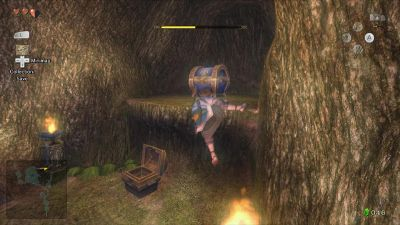{ .tp-heart-img }

- [ ] **#2** — Bomblings / Deku Likes room: Deku Like blocking alcove chest — drop Bombling into it, or return with *Bombs*. *(If Forest Temple cleared: need Clawshot to re-enter.)*

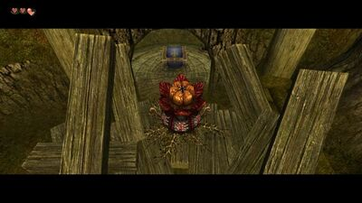{ .tp-heart-img }

- [ ] **#3** — Tile Worms room: *Gale Boomerang* — blow out **all torches** → hidden alcove chest. *(If temple cleared: Clawshot to return.)*

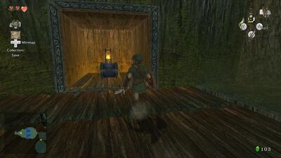{ .tp-heart-img }

### Hyrule Field

- [ ] **#4** — North of Faron Woods: defeat two Bulblin Warriors on the rise; *Gale Boomerang* the piece from the **north tree** (before the bridge).

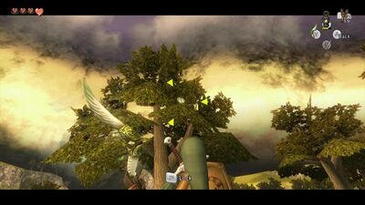{ .tp-heart-img }

- [ ] **#5** — South of Kakariko Village: two large rock formations toward field center; piece on the **larger** one — *Gale Boomerang*.

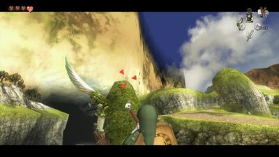{ .tp-heart-img }

- [ ] **#14** — East of Castle Town (exit Kakariko north): blow boulders with *Bombs*, vines + *Bomb Arrows* on ledge boulders, climb to ledge chest.

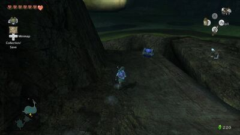{ .tp-heart-img }

### Ordon Village & Ordon Woods

- [ ] **#6** — After light returns to Eldin and you have *Epona*: daytime goat herding with Fado — herd **20 goats in under 3 minutes**.

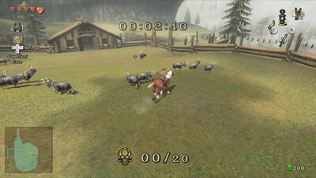{ .tp-heart-img }

- [ ] **#40** — *Dominion Rod*: Ordon Woods (north of village, Coro area) — Sky Character on map; move statue into circular hole; wolf on rock + Midna jump to branches above Faron Woods → hidden chest.

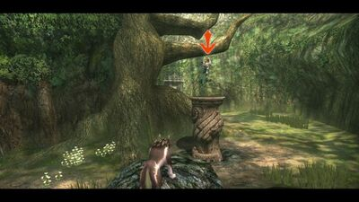{ .tp-heart-img }

### Goron Mines & Eldin

- [ ] **#7** — Ceiling magnetic room: *Iron Boots* — far **northeast** hidden platform, large chest.

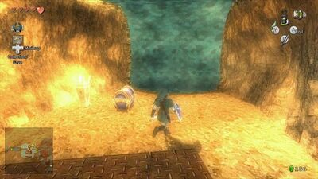{ .tp-heart-img }

- [ ] **#8** — Room north of central chamber (split room): north side Beamos; *Iron Boots* up **west** magnetic wall, turn south to platform chest.

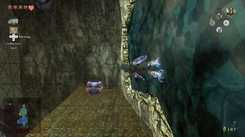{ .tp-heart-img }

- [ ] **#9** — After Goron Mines: climb village via Goron at tallest building; Talo’s bow lesson — shoot the **pole on the high building corner** (full draw, aim at building corner); Malo rewards the piece.

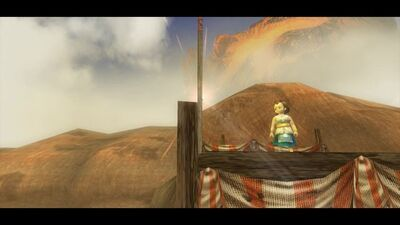{ .tp-heart-img }

- [ ] **#10** — Boulders above Eldin Spring: *Bomb Arrows* (after buying Bombs from Barnes); *Gale Boomerang* the piece down.

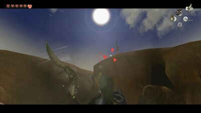{ .tp-heart-img }

- [ ] **#11** — Blow boulder near Eldin Spring, path into spring; *Iron Boots* sink to underwater large chest.

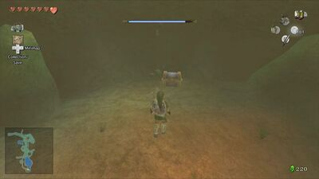{ .tp-heart-img }

- [ ] **#12** — Trail to Death Mountain after mines: second Goron — ride facing **left** off the ledge; north path, left alcove, drop down → chest.

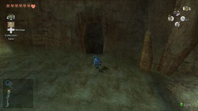{ .tp-heart-img }

### Kakariko & gorge

- [ ] **#13** — Kakariko Gorge Cavern (south gorge, bomb boulder): *Lantern*; forks **right, right, left, right** → Skulltula, light torches → chest.

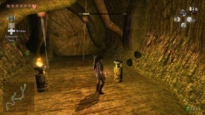{ .tp-heart-img }

- [ ] **#43** — Far **west** Kakariko Gorge: rock in the abyss; *Double Clawshots* to vines, climb around → platform chest.

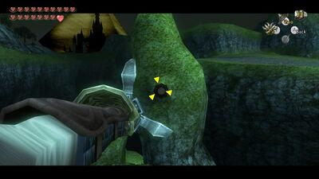{ .tp-heart-img }

### Castle Town & bridges

- [ ] **#15** — Castle Town west exit (north of Purlo): Charlo — donate **1,000 Rupees** (or sell Golden Bugs to Agitha).

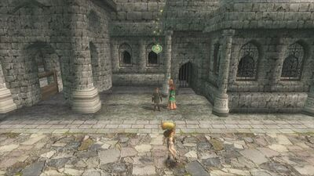{ .tp-heart-img }

- [ ] **#22** — West Castle Town Bridge: Goron leaves piece after Malo Mart side quest (Hot Spring Water). See [Malo Mart guide](https://www.zeldadungeon.net/wiki/Malo_Mart).

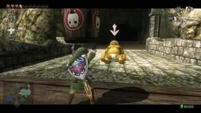{ .tp-heart-img }

- [ ] **#39** — Bridge of Eldin north: *Dominion Rod* — Owl Statue on upper ledge; walk south, drop to lower area, jump across to ladder; Bulblin Archer → chest on wall.

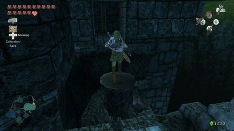{ .tp-heart-img }

### Lake Hylia & fishing

- [ ] **#16** — Hena’s Fishing Hole: piece on central pillar rock — *Fishing Rod* from boat or *Gale Boomerang* from shore. *~20 Rupees to fish.*

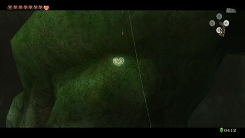{ .tp-heart-img }

- [ ] **#17** — Falbi’s Flight-by-Fowl (Fyer to sky, **20 Rupees**): glide to Isle of Riches — **second-highest** (small, non-spinning) tier chest.

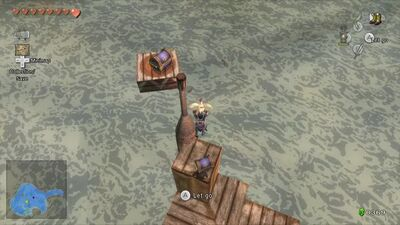{ .tp-heart-img }

- [ ] **#18** — Lake Hylia south: ladder, bomb southern boulder → cavern; *Lantern* + *Bombs* through to end chest.

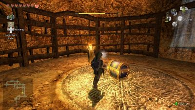{ .tp-heart-img }

- [ ] **#23** — Lanayru Spring: *Clawshot* vines left/right to far south hidden room; *Lantern* — two torches → chest.

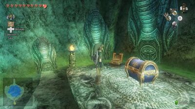{ .tp-heart-img }

- [ ] **#24** — After Lanayru light + *Master Sword* & *Shadow Crystal*: wolf at Hawk Grass → Plumm’s balloon game on Zora’s River — **only oranges or only strawberries**, score **10,000+**.

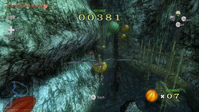{ .tp-heart-img }

### Lakebed Temple

- [ ] **#19** — Both water flows restored: lower east section flooded; rotating platforms room — stand switch, *Clawshot* through gate before it closes → chest.

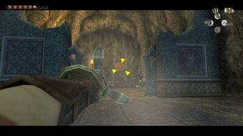{ .tp-heart-img }

- [ ] **#20** — Central chamber (spinning staircase): *Clawshot* to giant **chandelier** on ceiling (targets in all compass directions) → chest on top.

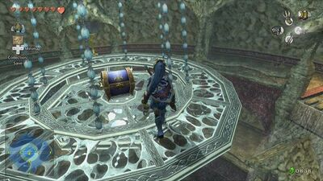{ .tp-heart-img }

### Sacred Grove

- [ ] **#21** — *Master Sword*, *Shadow Crystal*, *Bombs*: side area (first Skull Kid fight); bomb boulder → wolf dig sparkly spot → Baba Serpent grotto (Gale Boomerang ceiling ones); clear all → chest. *(Can return via Twilight Portal if missed.)*

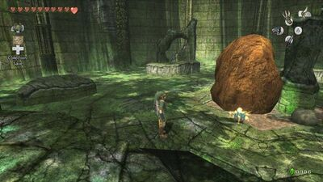{ .tp-heart-img }

### Gerudo Desert & Arbiter’s Grounds

- [ ] **#26** — Bulblin Fortress (before Arbiter’s Grounds): northeast corner — slash roasting **Bullbo** until it explodes.

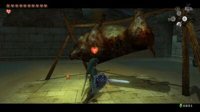{ .tp-heart-img }

- [ ] **#27** — Central quicksand / blue flame room: **right** stairs chest — *Clawshot* over; **roll back** on platforms (avoid drowning).

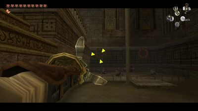{ .tp-heart-img }

- [ ] **#28** — Spinner rails room: mid level, far **east** upper platform — defeat Stalfos, chest.

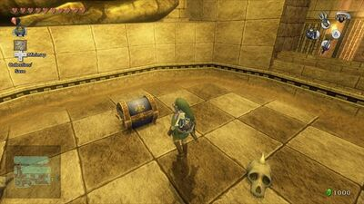{ .tp-heart-img }

- [ ] **#29** — North of Great Bridge of Hylia: back route after *Bombs* clear boulders; Spinner rails shortcut — bounce between rails to platform chest.

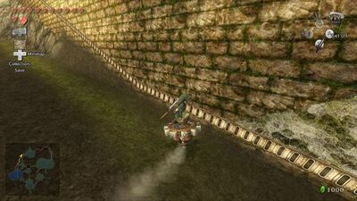{ .tp-heart-img }

### Snowpeak & ice

- [ ] **#30** — North of Bridge of Eldin (small bridge by Hidden Village entrance): Spinner on **north** wall → grass platform; wolf dig center → three Stalfos → chest.

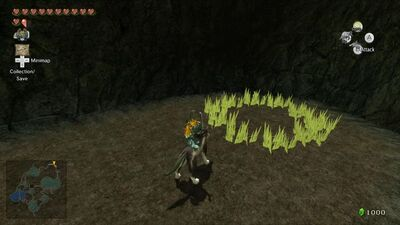{ .tp-heart-img }

- [ ] **#31** — Snowpeak Ruins 2F far southwest (Freezards + cannon): corner wall target; *Bombs* or *Ball and Chain* on uneven floor → drop to 1F chest; Clawshot back up.

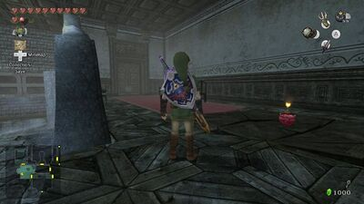{ .tp-heart-img }

- [ ] **#32** — Snowpeak 2F entrance: Ball and Chain west (GCN) door target; chandelier hop south to far south chest on mini-map.

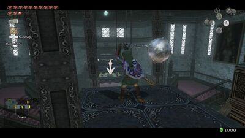{ .tp-heart-img }

- [ ] **#33** — Ice Block Cavern (Hyrule Field north of Castle Town, lower rocky north): *Ball and Chain* + *Bombs*; three block puzzle rooms — see [Block Puzzle Guide](https://www.zeldadungeon.net/wiki/Block_Puzzle_Guide).

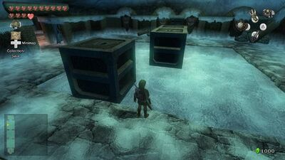{ .tp-heart-img }

- [ ] **#34** — After Snowpeak Ruins: warp peak, race **Yeto** (hold forward), then **Yeta** (take her mid-race shortcut on map).

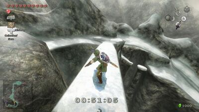{ .tp-heart-img }

### Bridge of Eldin cavern

- [ ] **#25** — North of Bridge of Eldin: Clawshot to upper platform target; east to cavern; *Iron Boots* through magnetic path to bottom chest.

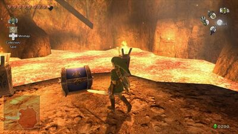{ .tp-heart-img }

### Temple of Time

- [ ] **#35** — Lizalfos / Dynalfos moving walls: chest behind electric barrier — Dominion Rod statue (giant or small) on far switch.

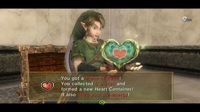{ .tp-heart-img }

- [ ] **#36** — Spinning platform room: collect small statues, south floor switches, east room — Dominion Rod upper statue onto south switch + second statue; east alcove chest appears.

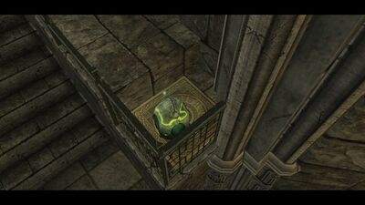{ .tp-heart-img }

- [ ] **#37** — Temple entrance (before dungeon): *Dominion Rod* — move **east** Owl Statue → alcove chest.

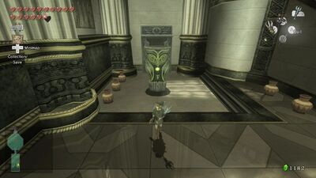{ .tp-heart-img }

### Hidden Village

- [ ] **#38** — After Ilia’s memory restored: Hidden Village cats — wolf talk; find **cucco leader** in east building (break glass); “play” = talk to every cat across village; pick up the piece before leaving.

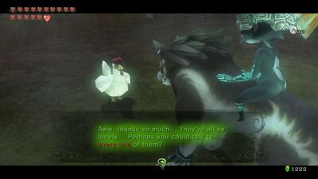{ .tp-heart-img }

### City in the Sky

- [ ] **#41** — Big Baba cylinder room, 2F: cross skinny platforms west; shoot ceiling Keese; claw left wall, sidestep to alcove chest.

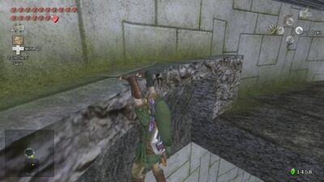{ .tp-heart-img }

- [ ] **#42** — South 3F outdoor Peahat “V”: *Double Clawshots* along them south to unreachable platform chest.

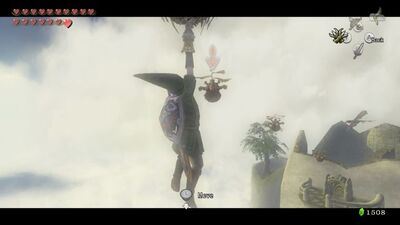{ .tp-heart-img }

### Palace of Twilight

- [ ] **#44** — East wing: one black fog “waterfall” has alcove chest on map — place **Sol** (or light-infused Master Sword); Clawshot to upper chest.

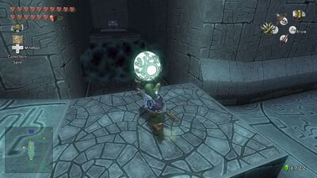{ .tp-heart-img }

- [ ] **#45** — West wing first room: light dark orb with Sol → platforms; **east** platform alcove = final piece. *(Or return with light-infused sword.)*

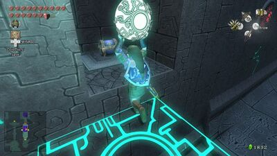{ .tp-heart-img }

---

<strong>0</strong> / 45 collected · <strong>45</strong> remaining

---

## Quick reference — prerequisites

| Need | Heart pieces (examples) |
|------|-------------------------|
| Lantern | #1, #13, #18, #23 |
| Gale Boomerang | #3, #4, #5, #10, #16, #21 (ceiling Babas) |
| Bombs | #2, #10–#11, #13–#14, #18, #21, #26, #29, #31–#33 |
| Iron Boots | #7–#8, #11, #25 |
| Hero’s Bow | #9–#10 |
| Epona | #6 |
| Clawshot | #19–#20, #23, #27 |
| Master Sword + Shadow Crystal | #21, #24 |
| Dominion Rod | #35–#37, #39–#40 |
| Double Clawshots | #41–#43 |
| Sol / light sword | #44–#45 |
