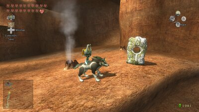
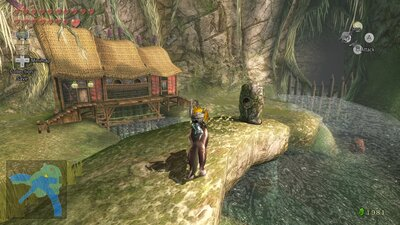
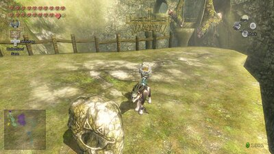
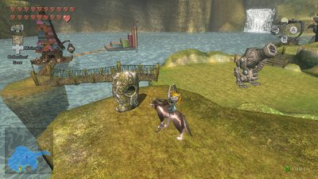
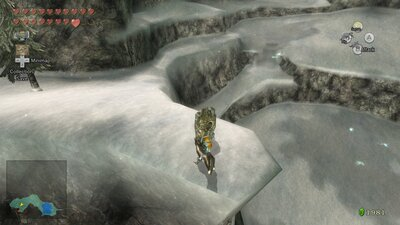
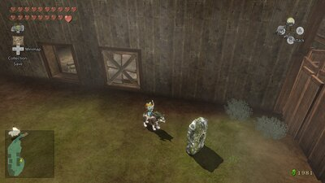
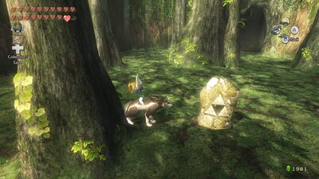

# Twilight Princess — Howling Stones checklist

All **7** [Howling Stones](https://www.zeldadungeon.net/wiki/Howling_Stone) in [*The Legend of Zelda: Twilight Princess*](https://www.zeldadungeon.net/wiki/The_Legend_of_Zelda:_Twilight_Princess). Six bear the Sheikah eye and teach a [Hidden Skill](https://www.zeldadungeon.net/wiki/Hidden_Skill) through the [Hero's Spirit](https://www.zeldadungeon.net/wiki/Hero%27s_Spirit); the seventh (Triforce mark in the [Sacred Grove](https://www.zeldadungeon.net/wiki/Sacred_Grove)) summons [Skull Kid](https://www.zeldadungeon.net/wiki/Skull_Kid) for story progression.

Source: [Zelda Dungeon Wiki — Howling Stone](https://www.zeldadungeon.net/wiki/Howling_Stone) (converted to a personal checklist; verify in-game if anything differs on your version). Location screenshots are from the same wiki (hosted locally for offline use).

Progress is saved in **this browser only** (local storage on GitHub Pages). It does not sync across devices; clearing site data resets the checklist.

**How it works:** As [wolf Link](https://www.zeldadungeon.net/wiki/Wolf_Link), howl the stone’s tune, then howl again in the golden ether. A wolf-head marker appears on the map — visit it as human Link to learn the skill. **Hidden skills are learned in a fixed order** (Shield Attack → Back Slice → …) no matter which stone you activate first.

**Version note:** Directions match **GameCube** and **Twilight Princess HD (Normal Mode)**. On **Wii** or **TP HD Hero Mode**, the overworld is mirrored — swap left/right and east/west when following compass hints.

**Also:** [Ending Blow](https://www.zeldadungeon.net/wiki/Ending_Blow) is taught in [Faron Woods](https://www.zeldadungeon.net/wiki/Faron_Woods) before the [Forest Temple](https://www.zeldadungeon.net/wiki/Forest_Temple) and does **not** use a Howling Stone.

---

## Checklist

Mark each stone when you have **howled at it and finished its event** (skill learned, or Skull Kid summoned for the Triforce stone).

### Sheikah eye stones (Hidden Skills)

- [ ] **#1** — **[Death Mountain](https://www.zeldadungeon.net/wiki/Death_Mountain):** geyser field on the trail up the mountain (hard to miss). Howl **[Song of Healing](https://www.zeldadungeon.net/wiki/Song_of_Healing)** → golden wolf at [Ordon Spring](https://www.zeldadungeon.net/wiki/Ordon_Spring) → **[Shield Attack](https://www.zeldadungeon.net/wiki/Shield_Attack)**. *Available on first Death Mountain trip (shadow insects).*

{ .tp-howling-img }

- [ ] **#2** — **[Upper Zora's River](https://www.zeldadungeon.net/wiki/Upper_Zora%27s_River):** hilltop overlooking [Hena's Fishing Hole](https://www.zeldadungeon.net/wiki/Hena%27s_Fishing_Hole) / river rapids building. Howl **[Requiem of Spirit](https://www.zeldadungeon.net/wiki/Requiem_of_Spirit)** → golden wolf on [Hyrule Field](https://www.zeldadungeon.net/wiki/Hyrule_Field) by the bridge to [Castle Town](https://www.zeldadungeon.net/wiki/Castle_Town) West Road (East Road on Wii / Hero Mode) → **[Back Slice](https://www.zeldadungeon.net/wiki/Back_Slice)**. *Reachable in twilight on first Zora’s River visit, or anytime after [Shadow Crystal](https://www.zeldadungeon.net/wiki/Shadow_Crystal).*

{ .tp-howling-img }

- [ ] **#3** — **[Faron Woods](https://www.zeldadungeon.net/wiki/Faron_Woods) (Deep Gorge):** on the path to the Sacred Grove caves, just outside the grove entrance. Howl **[Prelude of Light](https://www.zeldadungeon.net/wiki/Prelude_of_Light)** → golden wolf on Hyrule Field south of Castle Town (small Faron-side area via South Road) → **[Helm Splitter](https://www.zeldadungeon.net/wiki/Helm_Splitter)**. *On the route to the Sacred Grove before the [Master Sword](https://www.zeldadungeon.net/wiki/Master_Sword).*

{ .tp-howling-img }

- [ ] **#4** — **[Lake Hylia](https://www.zeldadungeon.net/wiki/Lake_Hylia):** south shore ledge — climb the ladder (needs Shadow Crystal). Howl the stone’s tune → golden wolf in [Gerudo Desert](https://www.zeldadungeon.net/wiki/Gerudo_Desert) near [Arbiter's Grounds](https://www.zeldadungeon.net/wiki/Arbiter%27s_Grounds) → **[Mortal Draw](https://www.zeldadungeon.net/wiki/Mortal_Draw)**.

{ .tp-howling-img }

- [ ] **#5** — **[Snowpeak](https://www.zeldadungeon.net/wiki/Snowpeak):** cliff ledge on the ascent toward the summit (Zora’s Domain side). Howl the stone’s tune → golden wolf in [Kakariko Village](https://www.zeldadungeon.net/wiki/Kakariko_Village) [Graveyard](https://www.zeldadungeon.net/wiki/Graveyard) → **[Jump Strike](https://www.zeldadungeon.net/wiki/Jump_Strike)**. *Return after the first Snowpeak escort — you cannot stray far from the scent trail on the initial climb.*

{ .tp-howling-img }

- [ ] **#6** — **[Hidden Village](https://www.zeldadungeon.net/wiki/Hidden_Village):** behind the building opposite [Impaz](https://www.zeldadungeon.net/wiki/Impaz), near the [Cucco Leader](https://www.zeldadungeon.net/wiki/Cucco_Leader). Howl the *Twilight Princess* main-theme tune → golden wolf on the bridge north of [Castle Town](https://www.zeldadungeon.net/wiki/Castle_Town) central square → **[Great Spin](https://www.zeldadungeon.net/wiki/Great_Spin)**.

{ .tp-howling-img }

### Triforce stone (story)

- [ ] **#7** — **[Sacred Grove](https://www.zeldadungeon.net/wiki/Sacred_Grove):** Triforce-marked stone in the grove. Howl **[Zelda's Lullaby](https://www.zeldadungeon.net/wiki/Zelda%27s_Lullaby)** → [Skull Kid](https://www.zeldadungeon.net/wiki/Skull_Kid) leads you to the true grove ([Master Sword](https://www.zeldadungeon.net/wiki/Master_Sword), [Temple of Time](https://www.zeldadungeon.net/wiki/Temple_of_Time)). *Required for main story — not a Hidden Skill.*

{ .tp-howling-img }

---

## Progress

<strong>0</strong> / 7 completed · <strong>7</strong> remaining

---

## Hidden Skills order (reference)

| Order | Skill | Typical stone region |
|-------|--------|----------------------|
| — | [Ending Blow](https://www.zeldadungeon.net/wiki/Ending_Blow) | Faron Woods (no stone) |
| 1st learned | Shield Attack | Death Mountain |
| 2nd | Back Slice | Upper Zora's River |
| 3rd | Helm Splitter | Faron Woods |
| 4th | Mortal Draw | Lake Hylia |
| 5th | Jump Strike | Snowpeak |
| 6th | Great Spin | Hidden Village |

Golden wolf map markers depend on which skill slot you are filling next, not which stone you used last.
