# Twilight Princess — Poe Souls checklist

All **60** [Imp Poe](https://www.zeldadungeon.net/wiki/Imp_Poe) souls in [*The Legend of Zelda: Twilight Princess*](https://www.zeldadungeon.net/wiki/The_Legend_of_Zelda:_Twilight_Princess). Fight them only as **wolf Link** with senses active. The first becomes available after **Lakebed Temple** (third dungeon).

**Rewards:** Give **20** souls to [Jovani](https://www.zeldadungeon.net/wiki/Jovani) for a [Bottle](https://www.zeldadungeon.net/wiki/Bottle) of [Great Fairy's Tears](https://www.zeldadungeon.net/wiki/Great_Fairy%27s_Tears). All **60** → [Gengle](https://www.zeldadungeon.net/wiki/Gengle) pays **200 Rupees** per visit.

Source: [Zelda Dungeon Wiki — Twilight Princess Poe Souls](https://www.zeldadungeon.net/wiki/Twilight_Princess_Poe_Souls) (converted to a personal checklist; verify in-game if anything differs on your version). Screenshots match the wiki’s **Poe Soul Locations** entries (hosted locally for offline use).

Progress is saved in **this browser only** (local storage on GitHub Pages). It does not sync across devices; clearing site data resets the checklist.

**Version note:** Directions below match **GameCube** and **Twilight Princess HD (Normal Mode)**. On **Wii** or **TP HD Hero Mode**, the overworld is mirrored — swap left/right and east/west when following compass hints.

---

## Checklist

Listed **#1–#60** in [wiki order](https://www.zeldadungeon.net/wiki/Twilight_Princess_Poe_Souls).

- [ ] **#1** — Found on the way to the Castle Town Sewers, hovering above a mountain of gold. *Conditions: None*

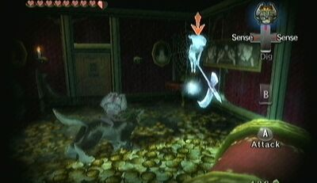{ .tp-poe-img }

- [ ] **#2** — In the area where Link fought Skull Kid, there's a boulder. Blow it up with a Bomb and kill the Imp Poe. *Conditions: After obtaining the Master Sword*

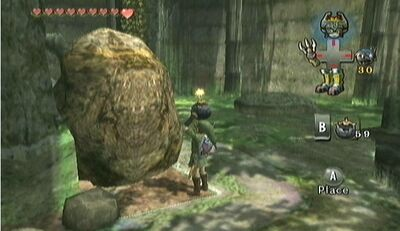{ .tp-poe-img }

- [ ] **#3** — In one of the rooms with a Lantern in the center, near the beginning. *Location: Lake Hylia Cavern* *Conditions: After obtaining the Master Sword*

{ .tp-poe-img }

- [ ] **#4** — In one of the rooms with a Lantern in the center, near the end. *Location: Lake Hylia Cavern* *Conditions: After obtaining the Master Sword*

{ .tp-poe-img }

- [ ] **#5** — In the final room, where there is a Piece of Heart and this Imp Poe. *Location: Lake Hylia Cavern* *Conditions: After obtaining the Master Sword*

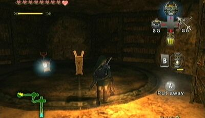{ .tp-poe-img }

- [ ] **#6** — At the bottom of the high tower to the east (Wii) or west (GCN/HD), only at night. *Conditions: After obtaining the Master Sword*

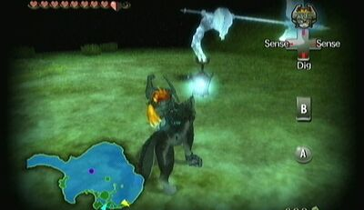{ .tp-poe-img }

- [ ] **#7** — In the southernmost area there will be a Poe hovering around at night. *Conditions: After obtaining the Master Sword*

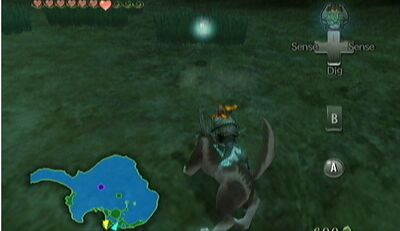{ .tp-poe-img }

- [ ] **#8** — On the small island in the far west (Wii) or east (GCN/HD), and only at night. *Conditions: After obtaining the Master Sword*

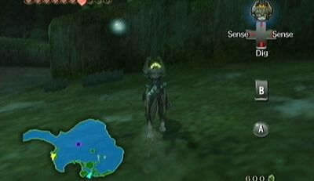{ .tp-poe-img }

- [ ] **#9** — Use Falbi's Flight-by-Fowl and immediately do a complete U-turn. There is a platform located under the game that has a Poe at night. *Conditions: After obtaining the Master Sword*

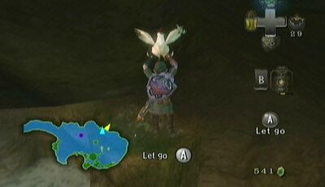{ .tp-poe-img }

- [ ] **#10** — Use Falbi's Flight-by-Fowl and fly to the square island beside Fyer's Cannon, called the Isle of Riches. On the second platform from the bottom there is a Poe at night. *Location: Isle of Riches* *Conditions: After obtaining the Master Sword*

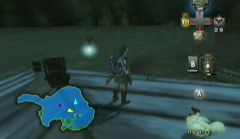{ .tp-poe-img }

- [ ] **#11** — Where the river forks is a chunk of land in between it. Swim over there at night to find an Imp Poe. *Location: Upper Zora's River* *Conditions: After obtaining the Master Sword*

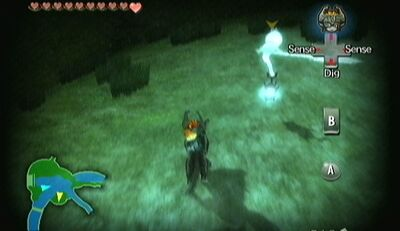{ .tp-poe-img }

- [ ] **#12** — From the water, swim over to the chunk of land to the west (Wii) or east (GCN/HD) and follow it to the end to find a Poe at night. *Conditions: After obtaining the Master Sword*

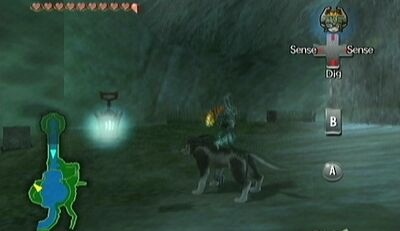{ .tp-poe-img }

- [ ] **#13** — On the east (Wii) or west (GCN/HD) side there is a ledge where Link can use Midna's Jump to reach a higher ledge. Follow the path and there will be a Poe in the path. *Conditions: After obtaining the Master Sword*

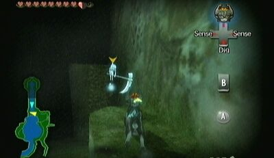{ .tp-poe-img }

- [ ] **#14** — Push the first tombstone on the left (Wii) or right (GCN/HD) and the Poe will appear at night. *Conditions: After obtaining the Master Sword*

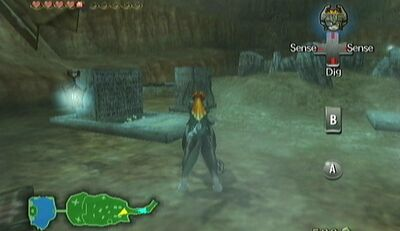{ .tp-poe-img }

- [ ] **#15** — In the middle of the graveyard at night. *Conditions: After obtaining the Master Sword*

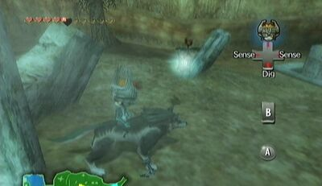{ .tp-poe-img }

- [ ] **#16** — Hovering around the destroyed Storehouse above the Bomb Shop. *Conditions: After obtaining the Master Sword*

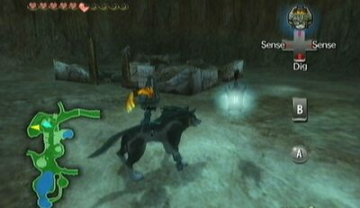{ .tp-poe-img }

- [ ] **#17** — Follow the ramp up from the Storehouse and beside the Lookout Tower will be a Poe at night. *Conditions: After obtaining the Master Sword*

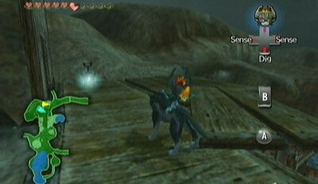{ .tp-poe-img }

- [ ] **#18** — On the way up the mountain there will be a Goron who will offer to give Link a ride up the cliff. Accept but instead of aiming up, aim to the right. Climb up and there will be a Poe floating around at night. *Conditions: After obtaining the Master Sword*

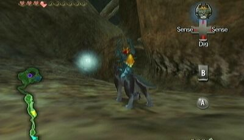{ .tp-poe-img }

- [ ] **#19** — In the deepest room of the Cavern there is a Poe, at night or day. In the Wii version go left, left, right, right; in the GCN and HD versions, it is right, right, left, left. *Location: Kakariko Gorge Cavern* *Conditions: After obtaining the Master Sword*

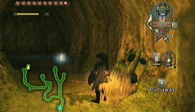{ .tp-poe-img }

- [ ] **#20** — Beside the tree on the raised platform in the middle of the area. Only around at night. *Conditions: After obtaining the Master Sword*

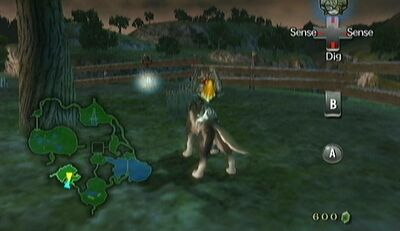{ .tp-poe-img }

- [ ] **#21** — In the portion of Hyrule Field found in the Faron Province, right in the middle area at night. *Conditions: After obtaining the Master Sword*

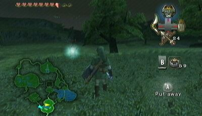{ .tp-poe-img }

- [ ] **#22** — In the area north of the Great Bridge of Hylia, there are some boulders high above that can be destroyed with a Bomb Arrow. Behind them will be a series of Clawshot targets. Follow the path of them which will lead to a Poe at night. *Location: South of the Great Bridge of Hylia* *Conditions: After obtaining the Master Sword*

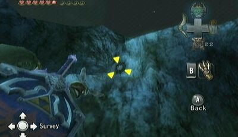{ .tp-poe-img }

- [ ] **#23** — In the east (Wii) or west (GCN/HD) area of Hyrule Field, at the southern section with all the ruins, there will be a Poe at night. *Conditions: After obtaining the Master Sword*

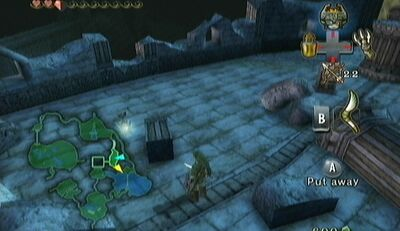{ .tp-poe-img }

- [ ] **#24** — In the area south of Castle Town, there will be a Poe on the flight of stairs there at night. *Conditions: After obtaining the Master Sword*

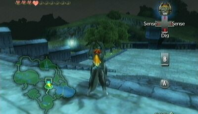{ .tp-poe-img }

- [ ] **#25** — Exit Castle Town on the west (Wii) or east (GCN/HD) side and there will be a Poe on the bridge at night. *Conditions: After obtaining the Master Sword*

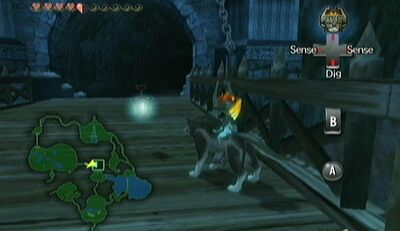{ .tp-poe-img }

- [ ] **#26** — In the area with the purple fog, follow Midna as a Wolf with the special jump and continue until reaching an area that is circular. At night, there is a Poe hovering around. *Conditions: After obtaining the Master Sword*

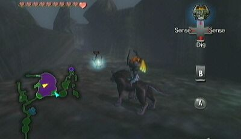{ .tp-poe-img }

- [ ] **#27** — After entering North Hyrule Field from East Hyrule Field (Wii) or West Hyrule Field (GCN/HD), keep going straight and soon enough Link will come across a circle of grass that is bare in the middle. Use Wolf Link's senses to find a spot he can dig through. Inside, there will be Deku Babas and two Imp Poes. *Conditions: After obtaining the Master Sword*

{ .tp-poe-img }

- [ ] **#28** — The second Poe Soul from the grotto described in Poe Soul #27. *Conditions: After obtaining the Master Sword*

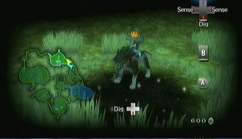{ .tp-poe-img }

- [ ] **#29** — In North Hyrule Field on the bridge in the center at night. *Conditions: After obtaining the Master Sword*

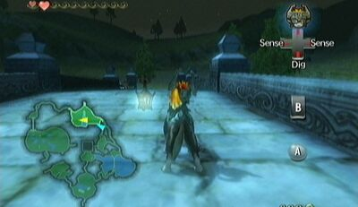{ .tp-poe-img }

- [ ] **#30** — As soon as Link enters the Desert, turn to the south and run over to the small rock platform. Around this area will be a Poe at night. *Conditions: After reaching the Gerudo Desert*

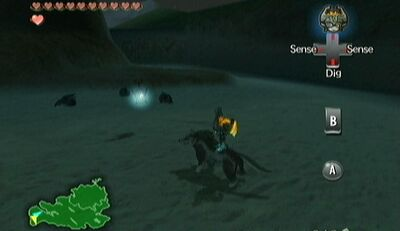{ .tp-poe-img }

- [ ] **#31** — In the far northwest (Wii) or northeast (GCN/HD) there will be a Peahat tree-thing that Link can Clawshot up to. Turn right and run all the way to the area that has three skulls in a circle on the floor. At night there will be a Poe floating about. *Conditions: After reaching the Gerudo Desert*

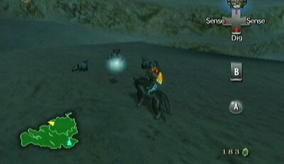{ .tp-poe-img }

- [ ] **#32** — In between the three skulls from the location of Poe Soul #31 is an underground cave. Inside there are two Imp Poes. *Conditions: After reaching the Gerudo Desert*

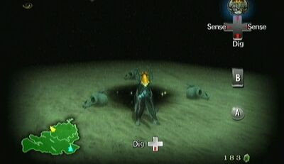{ .tp-poe-img }

- [ ] **#33** — In between the three skulls from the location of Poe Soul #31 is an underground cave. Inside there are two Imp Poes. *Conditions: After reaching the Gerudo Desert*

{ .tp-poe-img }

- [ ] **#34** — After warping to this area, there will be a Poe high above at night. *Conditions: After reaching the Gerudo Desert*

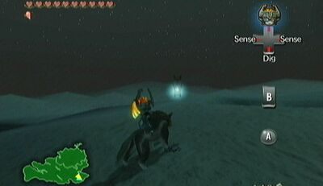{ .tp-poe-img }

- [ ] **#35** — Right before entering the next area of the Desert at the far north spot, turn right (Wii) or left (GCN/HD) and follow the path. At the end will be a Poe lingering at night. *Conditions: After reaching the Gerudo Desert*

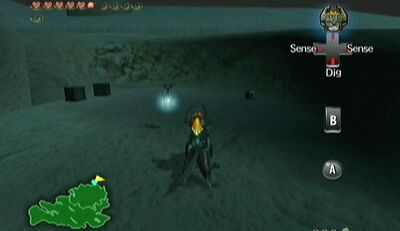{ .tp-poe-img }

- [ ] **#36** — After defeating King Bulblin and escaping from the flaming area, Link can find a Poe at night where he fought King Bulblin. *Conditions: After defeating King Bulblin in the Bulblin Fortress*

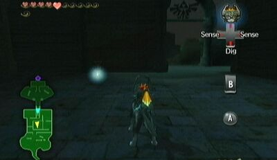{ .tp-poe-img }

- [ ] **#37** — In the area just outside of the Arbiter's Grounds, there is a Poe on the side corridor beside the door. *Location: Outside Arbiter's Grounds* *Conditions: After defeating King Bulblin in the Bulblin Fortress*

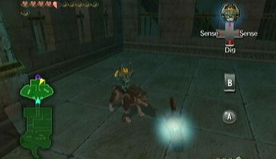{ .tp-poe-img }

- [ ] **#38** — One of four required Poe Souls in Arbiter's Grounds. Sniff the Poe Scent to track it down. *Conditions: After reaching the Arbiter's Grounds*

{ .tp-poe-img }

- [ ] **#39** — One of four required Poe Souls in Arbiter's Grounds. Sniff the Poe Scent to track it down. *Conditions: After reaching the Arbiter's Grounds*

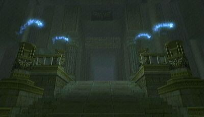{ .tp-poe-img }

- [ ] **#40** — One of four required Poe Souls in Arbiter's Grounds. Sniff the Poe Scent to track it down. *Conditions: After reaching the Arbiter's Grounds*

{ .tp-poe-img }

- [ ] **#41** — One of four required Poe Souls in Arbiter's Grounds. Sniff the Poe Scent to track it down. *Conditions: After reaching the Arbiter's Grounds*

{ .tp-poe-img }

- [ ] **#42** — On the way up Snowpeak, Link will pass through two large rocks that are close together. Directly on the other side to the right is a Poe, only at night. *Conditions: After obtaining the Reekfish Scent*

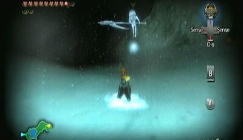{ .tp-poe-img }

- [ ] **#43** — While following the Reekfish Scent, there will come a time when the smell goes up a cliff. Link must turn right (Wii) or left (GCN/HD) and follow the ramp that leads back to the trail. At the top of the ramp, turn right (Wii) or left (GCN/HD) and follow the path to a Poe hovering beside a lone tree, only at night. *Conditions: After obtaining the Reekfish Scent*

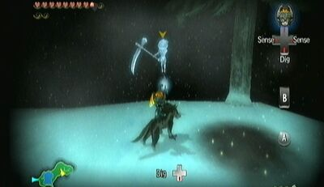{ .tp-poe-img }

- [ ] **#44** — Following the Reekfish Scent will eventually lead to a fork in the road. Turn left (Wii) or right (GCN/HD) and there will be a Poe hanging out on the first tree in the area. *Conditions: After obtaining the Reekfish Scent*

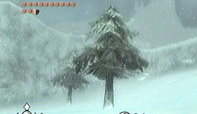{ .tp-poe-img }

- [ ] **#45** — In the area just outside of the Snowpeak Ruins, there is a spiraling hill that Link can climb to the top of. At the top is a Poe at night. *Location: Outside Snowpeak Ruins* *Conditions: After obtaining the Reekfish Scent*

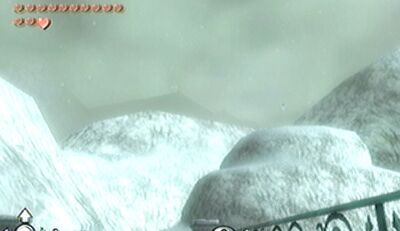{ .tp-poe-img }

- [ ] **#46** — Floating in the center of the first room in the dungeon. *Conditions: After reaching the Snowpeak Ruins*

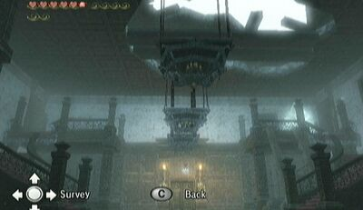{ .tp-poe-img }

- [ ] **#47** — In the first room, there are armored statues that can be destroyed with the Ball and Chain. After one has been destroyed, an Imp Poe will appear. *Conditions: After obtaining the Ball and Chain*

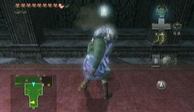{ .tp-poe-img }

- [ ] **#48** — In the room directly above the kitchen, there is a large wall of ice that when destroyed reveals a Poe hiding behind it. *Conditions: After obtaining the Ball and Chain*

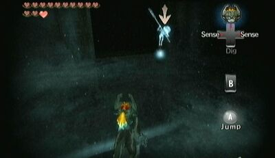{ .tp-poe-img }

- [ ] **#49** — After warping to the Snowpeak Top area, enter the cave to the north. Eventually Link will enter an area that has ice chunks on both sides. The one on the right (Wii) or left (GCN/HD) hides an Imp Poe. *Conditions: After obtaining the Ball and Chain*

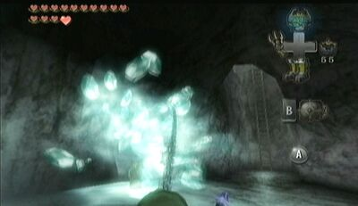{ .tp-poe-img }

- [ ] **#50** — In the area that Link chases Skull Kid around, there is a spot where he can swim through a waterfall and climb a ledge which leads to an Imp Poe. *Conditions: After completing the Snowpeak Ruins*

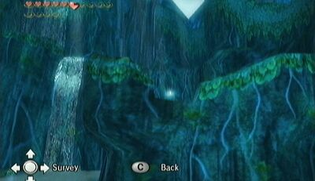{ .tp-poe-img }

- [ ] **#51** — In the area with the Pedestal of Time only at night. *Conditions: After completing the Snowpeak Ruins*

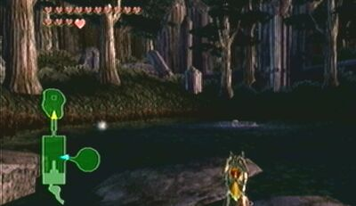{ .tp-poe-img }

- [ ] **#52** — On the seventh floor, put a ton of weight on the one side (by using the Dominion Rod to get more nearby metal jar things or putting the giant statue on one side). After doing so, stand on the other side so Link is higher than the pivot. Face the center of the room and Clawshot up to the target in the center of the ceiling. Walk over to the rails and use the Spinner to latch on to be taken over to high, southern platform. Kill the Imp Poe there. *Location: Temple of Time* *Conditions: After obtaining the Dominion Rod*

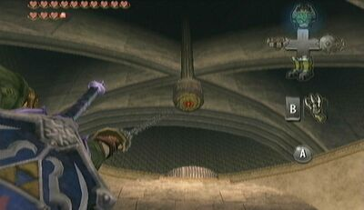{ .tp-poe-img }

- [ ] **#53** — Go to the large round room on the third floor, where there is a Poe behind a gate to the east (Wii) or west (GCN/HD). Use the Dominion Rod to move the little metal jars onto the switch that is behind the gate. Alternatively, while bringing the statue through the area, Link can use it to smash the gate with its hammer. Transform into a wolf and collect the Poe Soul. *Location: Temple of Time* *Conditions: After obtaining the Dominion Rod*

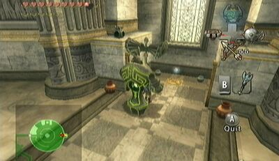{ .tp-poe-img }

- [ ] **#54** — In the past area of the Sacred Grove, there are two Owl Statues on either side of the staircase. One hides a Piece of Heart, and the other an Imp Poe. *Location: Sacred Grove (Past)* *Conditions: After obtaining the Dominion Rod*

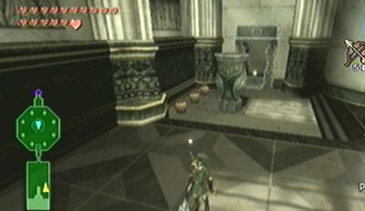{ .tp-poe-img }

- [ ] **#55** — In the Hidden Village on top of one of the balconies at night. *Conditions: After clearing the Hidden Village*

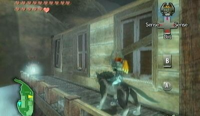{ .tp-poe-img }

- [ ] **#56** — In the room with all the moving Peahats, there is a small island to west (Wii) or east (GCN/HD) that houses an Imp Poe. *Location: City in the Sky* *Conditions: After obtaining the Double Clawshots*

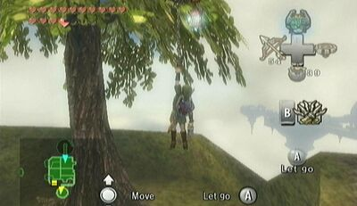{ .tp-poe-img }

- [ ] **#57** — In the outdoor room above the main room of the dungeon, there is a platform on the west (Wii) or east (GCN/HD) side that has a chest and an Imp Poe floating around. *Location: City in the Sky* *Conditions: After obtaining the Double Clawshots*

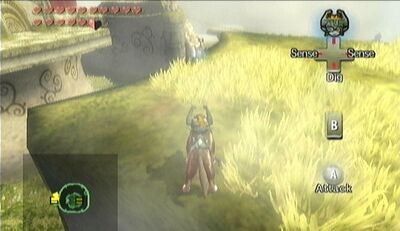{ .tp-poe-img }

- [ ] **#58** — On the 17th floor. *Location: Cave of Ordeals* *Conditions: After obtaining the Spinner*

{ .tp-poe-img }

- [ ] **#59** — On the 33rd floor. *Location: Cave of Ordeals* *Conditions: After obtaining the Dominion Rod*

{ .tp-poe-img }

- [ ] **#60** — On the 44th floor. *Location: Cave of Ordeals* *Conditions: After obtaining the Double Clawshots*

{ .tp-poe-img }

---

<strong>0</strong> / 60 collected · <strong>60</strong> remaining

---

## Quick reference — prerequisites

| Need | Poe souls (examples) |
|------|----------------------|
| None (after Lakebed Temple) | #1 |
| Master Sword | #2–#29 |
| Gerudo Desert | #30–#35 |
| King Bulblin defeated | #36–#37 |
| Arbiter's Grounds | #38–#41 (4 required in dungeon) |
| Reekfish Scent | #42–#45 |
| Snowpeak Ruins | #46–#49 |
| Dominion Rod | #52–#54, #59 |
| Double Clawshots | #56–#57, #60 |
| Spinner | #52, #58 |
| Ball and Chain | #47–#48 |
