# Twilight Princess — Poe Souls checklist

All **60** [Imp Poe](https://www.zeldadungeon.net/wiki/Imp_Poe) souls in [*The Legend of Zelda: Twilight Princess*](https://www.zeldadungeon.net/wiki/The_Legend_of_Zelda:_Twilight_Princess). Fight them only as **wolf Link** with senses active. The first becomes available after **Lakebed Temple** (third dungeon).

**Rewards:** Give **20** souls to [Jovani](https://www.zeldadungeon.net/wiki/Jovani) for a [Bottle](https://www.zeldadungeon.net/wiki/Bottle) of [Great Fairy's Tears](https://www.zeldadungeon.net/wiki/Great_Fairy%27s_Tears). All **60** → [Gengle](https://www.zeldadungeon.net/wiki/Gengle) pays **200 Rupees** per visit.

Source: [Zelda Dungeon Wiki — Twilight Princess Poe Souls](https://www.zeldadungeon.net/wiki/Twilight_Princess_Poe_Souls) (converted to a personal checklist; verify in-game if anything differs on your version). Location maps are from the same wiki (hosted locally for offline use).

Progress is saved in **this browser only** (local storage on GitHub Pages). It does not sync across devices; clearing site data resets the checklist.

**Version note:** Compass hints below match **GameCube** and **Twilight Princess HD (Normal Mode)**. On **Wii** or **TP HD Hero Mode**, the overworld is mirrored — swap left/right and east/west when following directions. Most overworld Poes appear **at night** only.

---

## Checklist

Poe soul **#** matches [wiki numbering](https://www.zeldadungeon.net/wiki/Twilight_Princess_Poe_Souls).

### Castle Town Sewers & Sacred Grove

- [ ] **#1** — Path to Castle Town Sewers: wolf senses — Imp Poe above the gold pile. *No prerequisites beyond Lakebed Temple (first Poe available).*

{ .tp-poe-img }

- [ ] **#2** — Sacred Grove (Skull Kid area): *Master Sword* + *Bombs* — bomb the boulder, defeat Imp Poe.

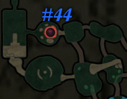{ .tp-poe-img }

### Lake Hylia Cavern

- [ ] **#3** — Lantern room near the beginning.

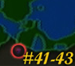{ .tp-poe-img }

- [ ] **#4** — Lantern room near the end.

{ .tp-poe-img }

- [ ] **#5** — Final room (same area as [heart piece #18](twilight-princess-heart-pieces.md)).

{ .tp-poe-img }

### Hyrule Castle Town

- [ ] **#6** — High tower east (Wii) / west (GCN·HD) — **night only**.

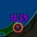{ .tp-poe-img }

- [ ] **#7** — Southernmost area — **night only**.

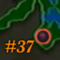{ .tp-poe-img }

- [ ] **#8** — Small island far west (Wii) / east (GCN·HD) — **night only**.

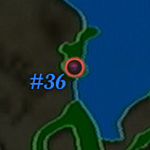{ .tp-poe-img }

- [ ] **#16** — Destroyed Storehouse above the Bomb Shop.

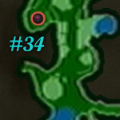{ .tp-poe-img }

- [ ] **#17** — Ramp up from the Storehouse, beside the Lookout Tower — **night only**.

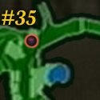{ .tp-poe-img }

- [ ] **#24** — South of town, on the flight of stairs — **night only**.

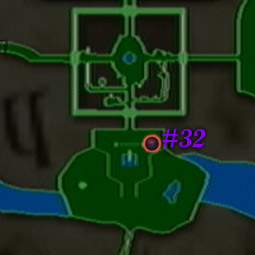{ .tp-poe-img }

- [ ] **#25** — West (Wii) / east (GCN·HD) exit bridge — **night only**.

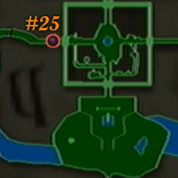{ .tp-poe-img }

### Lake Hylia, sky & Zora's River

- [ ] **#9** — Falbi's Flight-by-Fowl: U-turn immediately; platform under the game — **night only**.

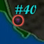{ .tp-poe-img }

- [ ] **#10** — Isle of Riches (square island by Fyer's Cannon): second platform from the bottom — **night only**.

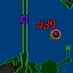{ .tp-poe-img }

- [ ] **#11** — Upper Zora's River fork — swim to the land between the forks at night.

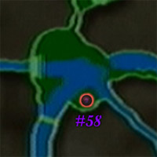{ .tp-poe-img }

- [ ] **#12** — From the water, swim to the west (Wii) / east (GCN·HD) land chunk and follow to the end — **night only**.

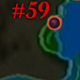{ .tp-poe-img }

- [ ] **#13** — East (Wii) / west (GCN·HD) ledge: Midna's Jump to higher ledge; Poe on the path.

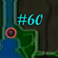{ .tp-poe-img }

- [ ] **#14** — Kakariko Graveyard: push the first tombstone on the left (Wii) / right (GCN·HD) — **night only**.

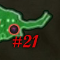{ .tp-poe-img }

- [ ] **#15** — Graveyard center — **night only**.

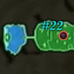{ .tp-poe-img }

### Death Mountain & Kakariko Gorge

- [ ] **#18** — Trail up the mountain: Goron offers a ride — aim **right** off the cliff instead of up; climb up — **night only**.

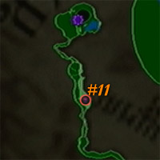{ .tp-poe-img }

- [ ] **#19** — Kakariko Gorge Cavern deepest room (day or night). Forks: left, left, right, right (Wii) · right, right, left, left (GCN·HD).

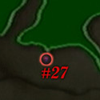{ .tp-poe-img }

- [ ] **#20** — Kakariko: tree on the raised platform in the middle — **night only**.

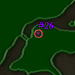{ .tp-poe-img }

### Hyrule Field

- [ ] **#21** — Faron Province portion, center of the field — **night only**.

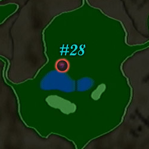{ .tp-poe-img }

- [ ] **#22** — North of the Great Bridge of Hylia: *Bomb Arrows* on high boulders → Clawshot path to the Poe — **night only**.

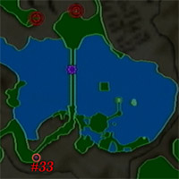{ .tp-poe-img }

- [ ] **#23** — East (Wii) / west (GCN·HD) ruins, southern section — **night only**.

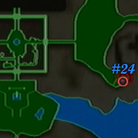{ .tp-poe-img }

- [ ] **#26** — Purple fog area: follow Midna's wolf jump through to the circular area — **night only**.

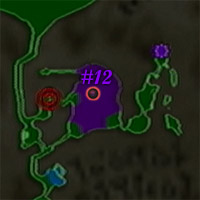{ .tp-poe-img }

- [ ] **#27** — North Hyrule Field: bare circle of grass (enter from east field on Wii / west on GCN·HD); wolf senses → dig grotto — first of two Imp Poes inside.

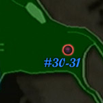{ .tp-poe-img }

- [ ] **#28** — Same grotto as **#27** — second Imp Poe.

{ .tp-poe-img }

- [ ] **#29** — North Hyrule Field center bridge — **night only**.

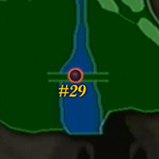{ .tp-poe-img }

### Gerudo Desert

- [ ] **#30** — On entering the desert, south to the small rock platform — **night only**.

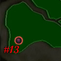{ .tp-poe-img }

- [ ] **#31** — Far northwest (Wii) / northeast (GCN·HD): Clawshot to the Peahat tree, turn right, run to the three-skull circle — **night only**.

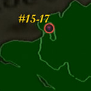{ .tp-poe-img }

- [ ] **#32** — Between the three skulls: underground cave — first Imp Poe.

{ .tp-poe-img }

- [ ] **#33** — Same cave as **#32** — second Imp Poe.

{ .tp-poe-img }

- [ ] **#34** — Snowpeak warp point area — Poe high above at night.

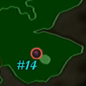{ .tp-poe-img }

- [ ] **#35** — Far north before the next desert area: turn right (Wii) / left (GCN·HD) at the path fork — **night only**.

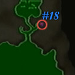{ .tp-poe-img }

### Bulblin Fortress & Arbiter's Grounds

- [ ] **#36** — After defeating King Bulblin and escaping the fire — where you fought him, **night only**.

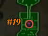{ .tp-poe-img }

- [ ] **#37** — Outside Arbiter's Grounds: side corridor beside the door.

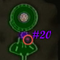{ .tp-poe-img }

- [ ] **#38** — Inside Arbiter's Grounds — **story-required** Poe; track with wolf senses / Poe Scent.

{ .tp-poe-img }

- [ ] **#39** — Inside Arbiter's Grounds — **story-required** Poe.

{ .tp-poe-img }

- [ ] **#40** — Inside Arbiter's Grounds — **story-required** Poe.

{ .tp-poe-img }

- [ ] **#41** — Inside Arbiter's Grounds — **story-required** Poe.

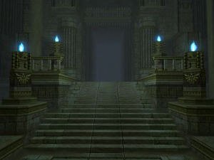{ .tp-poe-img }

### Snowpeak

- [ ] **#42** — On the trail up Snowpeak, through the two large rocks — Poe on the right, **night only**.

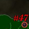{ .tp-poe-img }

- [ ] **#43** — Reekfish scent cliff: turn right (Wii) / left (GCN·HD) up the ramp back to the trail; at the top, turn right (Wii) / left (GCN·HD) to the lone tree — **night only**.

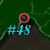{ .tp-poe-img }

- [ ] **#44** — Reekfish fork: turn left (Wii) / right (GCN·HD) — Poe on the first tree.

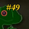{ .tp-poe-img }

- [ ] **#45** — Outside Snowpeak Ruins: spiral hill to the top — **night only**.

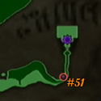{ .tp-poe-img }

- [ ] **#46** — Snowpeak Ruins first room center.

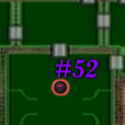{ .tp-poe-img }

- [ ] **#47** — First room: destroy an armored statue with *Ball and Chain*.

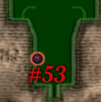{ .tp-poe-img }

- [ ] **#48** — Room above the kitchen: break the large ice wall.

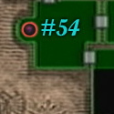{ .tp-poe-img }

- [ ] **#49** — Snowpeak Top cave north: ice chunk on the right (Wii) / left (GCN·HD) side hides a Poe.

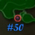{ .tp-poe-img }

### Sacred Grove & Temple of Time

- [ ] **#50** — Sacred Grove (Skull Kid chase): swim through the waterfall, climb the ledge.

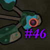{ .tp-poe-img }

- [ ] **#51** — Pedestal of Time area — **night only**.

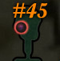{ .tp-poe-img }

- [ ] **#52** — Temple of Time 7F: weight the seesaw (Dominion Rod jars / giant statue), Clawshot ceiling, Spinner to south platform.

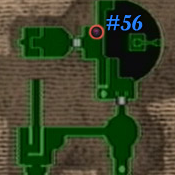{ .tp-poe-img }

- [ ] **#53** — Temple of Time 3F round room: Dominion Rod jars on the switch behind the east (Wii) / west (GCN·HD) gate — or smash the gate with the hammer statue.

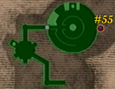{ .tp-poe-img }

- [ ] **#54** — Sacred Grove (Past): one of the two Owl Statues beside the stairs hides a Poe (the other hides [heart piece #37](twilight-princess-heart-pieces.md)).

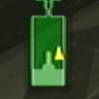{ .tp-poe-img }

### Hidden Village, City in the Sky & Cave of Ordeals

- [ ] **#55** — Hidden Village balcony — **night only**.

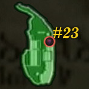{ .tp-poe-img }

- [ ] **#56** — City in the Sky: moving Peahats room — small island west (Wii) / east (GCN·HD).

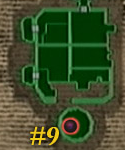{ .tp-poe-img }

- [ ] **#57** — Outdoor room above the main chamber — west (Wii) / east (GCN·HD) platform with chest.

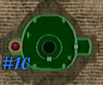{ .tp-poe-img }

- [ ] **#58** — Cave of Ordeals — **17th floor** (*Spinner*).

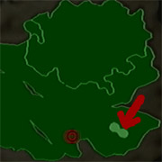{ .tp-poe-img }

- [ ] **#59** — Cave of Ordeals — **33rd floor** (*Dominion Rod*).

{ .tp-poe-img }

- [ ] **#60** — Cave of Ordeals — **44th floor** (*Double Clawshots*).

{ .tp-poe-img }

---

<strong>0</strong> / 60 collected · <strong>60</strong> remaining

---

## Quick reference — prerequisites

| Need | Poe souls (examples) |
|------|----------------------|
| Master Sword | #2–#29 (most overworld) |
| Bombs | #2 |
| Clawshot | #22, #31 |
| Gerudo Desert | #30–#35 |
| King Bulblin defeated | #36–#37 |
| Arbiter's Grounds | #38–#41 (4 required in dungeon) |
| Reekfish Scent | #42–#44 |
| Snowpeak Ruins | #46–#49 |
| Dominion Rod | #52–#54, #59 |
| Double Clawshots | #56–#57, #60 |
| Spinner | #52, #58 |
| Ball and Chain | #47–#48 |
